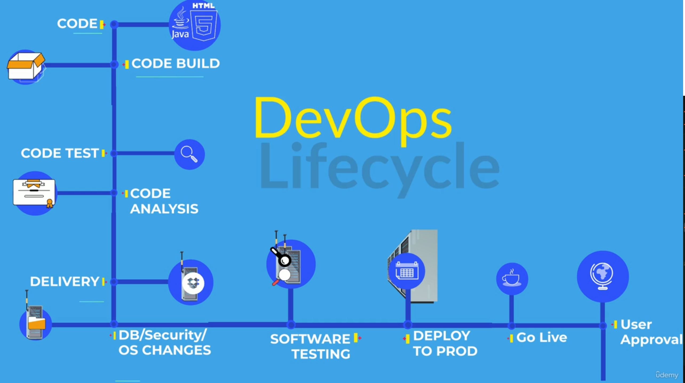
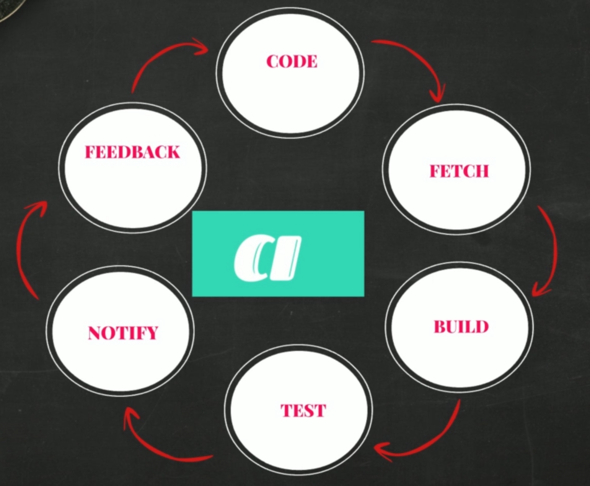
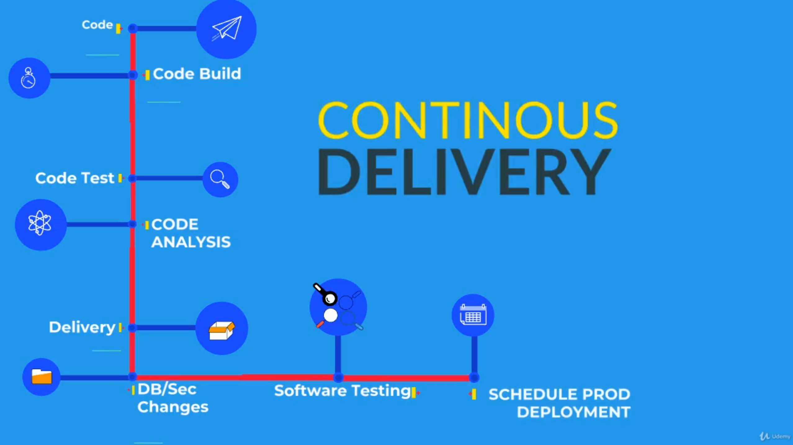

## 🚀 DevOps & Software Development Life Cycle (SDLC)

> **DevOps can accomplish tasks in minutes** that used to take hours or even days—accelerating delivery and allowing businesses to focus more on innovation and less on operational overhead.
>
> That’s why the IT industry is rapidly adopting DevOps culture—to streamline software development, deployment, and operations.

---

### 👩‍💼 **A Story: Emma's Journey to Digitize Her Art Gallery**

Meet **Emma**, an artist with a passion for collecting and selling artwork. She runs her own art gallery and wants to expand her business online through a **mobile app**, making her gallery accessible worldwide.

Since Emma doesn’t have a development team, she approaches a software consulting firm. She meets:

* **Reggie** – Director of Dev & Ops
* **Avi** – Project Manager of the Development Team
* **Freddy** – Head of Operations

Each expert explains how their teams will help build, test, deploy, and manage Emma's app.

Emma, being curious, wants to understand how software development works—and that’s where the **Software Development Life Cycle (SDLC)** comes in.

---

## 🛠️ **Software Development Process (SDLC)**

The **Software Development Life Cycle (SDLC)** is a structured process used by the software industry to design, develop, and maintain high-quality software. It consists of several key phases:

---

### **1. Requirement Gathering & Analysis**

* Collects essential information such as:

  * Product features
  * User needs
  * Market trends
  * Usage scenarios
* Stakeholders collaborate to define expectations.

---

### **2. Planning**

* Determines:

  * Scope of the project
  * Required resources and timelines
  * Potential risks
* Lays out a cost-effective and strategic roadmap.

---

### **3. Designing**

* Architects create:

  * Software/system architecture
  * Technical design documents
* These serve as the blueprint for development.

---

### **4. Development**

* Developers:

  * Write clean and functional code
  * Integrate modules based on design specs
* This is often the most resource-intensive phase.

---

### **5. Testing**

* Software is tested for:

  * Functional and non-functional bugs
  * Performance and security issues
* Only verified builds are promoted to production.

---

### **6. Deployment**

* Application is deployed to a live production environment.
* End-users can now interact with the software.

---

### **7. Maintenance**

* Involves:

  * Fixing bugs
  * Releasing patches
  * Improving features
* Ensures high availability and user satisfaction.

---

## 🔁 **SDLC Models**

Think of SDLC models as **roadmaps to a common destination**—they vary by cost, risk, flexibility, and delivery speed:

---

### ✅ **Waterfall Model**

* Linear and rigid
* Each phase must be completed before moving forward
* Difficult to go back and revise

---

### ✅ **Agile**

* Iterative and customer-focused
* Encourages frequent releases and continuous feedback
* Best for evolving projects

---

### ✅ **Spiral Model**

* Combines iterative design with risk analysis
* Ideal for large, complex, and high-risk projects

---

### ✅ **Big Bang Model**

* Little to no planning
* Suitable only for small or exploratory projects

---

> ⚠️ **Problem**: Dev teams often embrace Agile, while Ops teams still operate in a Waterfall model—this disconnect slows down releases.

---

## 🔄 **Enter DevOps: Bridging Dev & Ops**

DevOps integrates **development (Dev)** and **operations (Ops)** to eliminate silos, shorten release cycles, and increase collaboration.

**Key DevOps Benefits:**

* Faster time to market
* Continuous integration and delivery (CI/CD)
* Automated testing and deployment
* Better collaboration across teams
* Improved product quality and uptime

---



---

# ⚙️ Continuous Integration (CI) in DevOps

**Continuous Integration (CI)** is a core DevOps practice that automates the process of building, testing, and validating code whenever a team member commits changes to version control.

---

## 🎬 Introduction to CI

> **"Continuous integration is an automated process in DevOps, which generates software and its features quickly and efficiently."**

In a modern development environment, developers collaborate by writing code in teams. It’s ideal to store and manage this code in a **centralized version control system** like GitHub.

---

## 🔁 The CI Workflow

### 👩‍💻 Developers' Workflow:

* Write several lines of code daily.
* Frequently push/pull changes to/from a central repository.

### 🧠 Behind the Scenes:

1. **Version Control System (e.g., GitHub)** stores the code.
2. **Build Server** fetches the code continuously.
3. Code is **built, tested, and evaluated**.
4. An **artifact** (the packaged software) is generated and stored.

---

## 📦 What is an Artifact?

An artifact is an **archive of files** generated by the build process.

Examples:

* **Java**: `.jar`, `.war`
* **Windows**: `.exe`, `.dll`, `.msi`
* **General**: `.zip`, `.tar.gz`

Once built, these artifacts are stored in **software repositories** and moved to test or production servers.

---

## 🐛 Problems Without CI

Without continuous integration:

* Developers commit large amounts of code over weeks.
* Build fails due to **bugs, conflicts, and outdated dependencies**.
* Delayed bug detection leads to **rework and frustration**.

> “This could have been much easier if problems were caught earlier.”

---

## ✅ CI: The Solution

> “After every commit, the code should be built and tested—automatically.”

### 🔄 CI Cycle:

1. Developer commits code.
2. CI tool fetches it.
3. It’s automatically:

   * **Built**
   * **Tested**
   * **Evaluated**
4. Notification sent for success or failure.
5. Fix → Re-commit → Repeat.

This way, **defects are detected early** and do not multiply.

---

## 🔃 Visualize the CI Cycle

```text
[Code Commit] → [Build] → [Test] → [Notify] → [Fix] → [Repeat]
```



This forms a continuous **feedback loop**, ensuring each piece of code is clean and deployable.

---

## 🧰 CI Ecosystem Tools

| **Component**       | **Examples**                                                          |
| ------------------- | --------------------------------------------------------------------- |
| **IDE**             | Eclipse, VS Code, Atom, PyCharm                                       |
| **Version Control** | Git, SVN, TFS, Perforce                                               |
| **Build Tools**     | Maven, Ant, Gradle, MSBuild, Visual Build, IBM UrbanCode, Make, Grunt |
| **Software Repos**  | Sonatype Nexus, JFrog Artifactory, Apache Archiva, Cloudsmith         |
| **CI Tools**        | Jenkins, CircleCI, TeamCity, Bamboo CI, CruiseControl                 |

---

## 🎯 Goal of CI

* **Detect defects early**.
* **Avoid long integration cycles**.
* **Speed up delivery** of tested, production-ready software.

---

# 🚚 Continuous Delivery (CD) in DevOps

**Continuous Delivery (CD)** is an automated software engineering process that ensures code changes are reliably and efficiently delivered to production-like environments.

---

## 📌 What is Continuous Delivery?

> **"Continuous Delivery is an automated process of delivering code changes to servers quickly and efficiently at an enormous pace."**

It is the **natural extension of Continuous Integration (CI)**.

---

## 🔄 CI → CD Flow

1. Developers push code.
2. CI automatically builds and tests the code.
3. If successful, an **artifact** is created and stored in a **software repository**.
4. CD takes this artifact and **automates the deployment** process to staging, QA, or production servers.

---

## 🧱 Problems Without CD

* Ops teams manually deploy builds for further testing.
* Manual deployment is error-prone and slow.
* Frequent **deployment failures** increase lead time.
* Agile practices generate constant code changes needing deployment.
* **Too much manual intervention** and back-and-forth communication between Dev, Ops, and QA.

---

## 🛠️ What Deployment Really Involves

Deployment is **not just copying files** to a server. It can also include:

* Provisioning infrastructure (e.g., VMs, containers).
* Installing server dependencies.
* Modifying configurations.
* Adjusting firewall and network rules.
* Executing deployment steps and post-deployment validations.

---

## 🤖 Automate Everything!

> **"Automate it and save your time—and failures."**

### 🔧 Tools for Automation:

| **Category**           | **Tools**                 |
| ---------------------- | ------------------------- |
| System Automation      | Ansible, Puppet, Chef     |
| Infrastructure as Code | Terraform, CloudFormation |
| CI/CD Automation       | Jenkins, Octopus Deploy   |

---

## 🧪 Automate Testing Too!

Testing types that should be automated:

* Functional
* Load/Performance
* Database
* Network
* Security
* And more…

### Collaboration:

* **Ops Team**: Writes deployment automation.
* **Testers**: Write test automation scripts.
* **Developers**: Integrate everything into source control.

---

## 🔁 Unified Pipeline = Continuous Delivery

A fully automated pipeline looks like this:

```text
Code Commit →
Build & Test (CI) →
Artifact Creation →
Infrastructure Provisioning →
Deployment →
Automated Testing →
Ready for Production
```

---

## 🧩 Everything Stitched Together

> **"Automate every step and then stitch everything together."**

When deployment and testing are fully automated and integrated, we achieve:

### ✅ **Continuous Delivery Automation**

---

- https://github.com/devopshydclub/vprofile-project/blob/prereqs/Prereqs_doc.md

### Some Tools

- Oracle vm virtualbox
- git bash
- Vagrant is a command-line utility for managing as well as creating Virtual machines on a system. Vagrant automates the setup process of creating the Virtual machine on Virtualization tools like VirtualBox. It saves time and reduces headaches by making it easy to manage the environment for developing and testing your software.
- chocolatey/brew/command line

### Sign up
- github
- domain purchase
- dockerhub
- sonarcloud

Here's your refined and beautifully formatted AWS setup guide, maintaining clarity and a professional tone suitable for sharing, printing, or uploading to repositories:

---

# 🌐 AWS Account Setup with Security Best Practices

Securely launch your AWS Free Tier account with this step-by-step guide. You'll configure multi-factor authentication (MFA), create IAM users, set billing alarms, request SSL certificates, and personalize your IAM login — all following AWS best practices.

---

## 📑 Table of Contents

1. [Create AWS Free Tier Account](#1-create-aws-free-tier-account)
2. [Enable MFA for Root User](#2-enable-mfa-for-root-user)
3. [Create IAM User with Admin Access](#3-create-iam-user-with-admin-access)
4. [Set Up Billing Alarms](#4-set-up-billing-alarms)
5. [Request SSL Certificate via ACM](#5-request-ssl-certificate-via-acm)
6. [Customize IAM Login URL](#6-customize-iam-login-url)
7. [Security Recommendations](#7-security-recommendations)

---

## 1. ✅ Create AWS Free Tier Account

* Visit [AWS Free Tier](https://aws.amazon.com/free/)
* Click **“Create a Free Account”**
* Enter:

  * Email address
  * Account name
  * Strong root password (store in a password manager)
* Provide billing information (valid credit/debit card required)
* Complete phone verification
* Choose **“Basic Support”** plan (free)

---

## 2. 🔐 Enable MFA for Root User

1. Open the **IAM** service
2. Under *"Security recommendations"*, click **“Add MFA”**
3. Choose **Authenticator app** (e.g., Google Authenticator)
4. Scan the QR code with your mobile app
5. Enter two consecutive 6-digit codes
6. Click **“Add MFA”** to complete setup

---

## 3. 👤 Create IAM User with Admin Access

1. Go to **IAM → Users → Add user**
2. Fill in:

   * **Username**: `itadmin` (or preferred)
   * Enable **AWS Management Console access**
   * Choose **Autogenerate password**
   * Enable **password reset at next login**
3. **Permissions**:

   * Select **Attach policies directly**
   * Choose **AdministratorAccess**
4. Save credentials (CSV download)
5. Repeat MFA setup for this IAM user

---

## 4. 💰 Set Up Billing Alarms

### Enable Billing Preferences:

1. Go to **Billing Dashboard → Billing Preferences**
2. Enable:

   * ✅ Receive Free Tier alerts
   * ✅ Receive CloudWatch billing alerts

### Create Billing Alarm:

1. Open **CloudWatch** in **US East (N. Virginia)**
2. Go to **Alarms → Create Alarm**
3. Select:

   * Metric: **Billing > Total Estimated Charge**
   * Threshold: e.g., **\$5.00 USD**
4. Create an **SNS topic** (Simple Notification Service)

   * Enter your email address
   * Confirm email subscription from inbox
5. Name the alarm (e.g., `AWS Billing Alert`)

---

## 5. 🔒 Request SSL Certificate via ACM

1. Go to **Certificate Manager (ACM)**
2. Click **“Request a certificate”**
3. Choose **Request a public certificate**
4. Enter domain: `*.yourdomain.com`
5. Select **DNS Validation**
6. In your domain registrar’s DNS panel:

   * Add a **CNAME record**
   * Name: strip domain portion from the provided name
   * Value: paste the full value from ACM
7. Wait for certificate validation (may take up to 48 hours)

---

## 6. 🌐 Customize IAM Login URL

1. In **IAM Dashboard**, click **“Customize”** under **IAM users sign-in link**
2. Enter alias (e.g., `yourcompany`)
3. Your login URL becomes:
   `https://yourcompany.signin.aws.amazon.com/console`
4. Test IAM login:

   * Use credentials from CSV
   * Change password on first login
   * Enter MFA code when prompted

---

## 7. 🔒 Security Recommendations

* Avoid using the **root user** for daily tasks
* **Never share** root credentials or access keys
* Enable **MFA** for all IAM users
* Store passwords and credentials in a **secure password manager**
* **Review billing dashboard** regularly
* **Delete unused resources** to avoid unexpected charges
* Keep your contact information updated for billing alerts

---

> ⚠️ AWS charges may apply if usage exceeds Free Tier limits. Monitor your usage regularly!