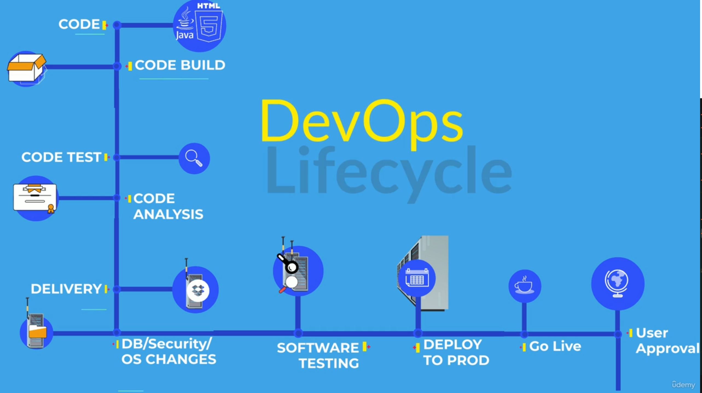

## 🚀 DevOps & Software Development Life Cycle (SDLC)

> **DevOps can accomplish tasks in minutes** that used to take hours or even days—accelerating delivery and allowing businesses to focus more on innovation and less on operational overhead.
>
> That’s why the IT industry is rapidly adopting DevOps culture—to streamline software development, deployment, and operations.

---

### 👩‍💼 **A Story: Emma's Journey to Digitize Her Art Gallery**

Meet **Emma**, an artist with a passion for collecting and selling artwork. She runs her own art gallery and wants to expand her business online through a **mobile app**, making her gallery accessible worldwide.

Since Emma doesn’t have a development team, she approaches a software consulting firm. She meets:

- **Reggie** – Director of Dev & Ops
- **Avi** – Project Manager of the Development Team
- **Freddy** – Head of Operations

Each expert explains how their teams will help build, test, deploy, and manage Emma's app.

Emma, being curious, wants to understand how software development works—and that’s where the **Software Development Life Cycle (SDLC)** comes in.

---

## 🛠️ **Software Development Process (SDLC)**

The **Software Development Life Cycle (SDLC)** is a structured process used by the software industry to design, develop, and maintain high-quality software. It consists of several key phases:

---

### **1. Requirement Gathering & Analysis**

- Collects essential information such as:

  - Product features
  - User needs
  - Market trends
  - Usage scenarios

- Stakeholders collaborate to define expectations.

---

### **2. Planning**

- Determines:

  - Scope of the project
  - Required resources and timelines
  - Potential risks

- Lays out a cost-effective and strategic roadmap.

---

### **3. Designing**

- Architects create:

  - Software/system architecture
  - Technical design documents

- These serve as the blueprint for development.

---

### **4. Development**

- Developers:

  - Write clean and functional code
  - Integrate modules based on design specs

- This is often the most resource-intensive phase.

---

### **5. Testing**

- Software is tested for:

  - Functional and non-functional bugs
  - Performance and security issues

- Only verified builds are promoted to production.

---

### **6. Deployment**

- Application is deployed to a live production environment.
- End-users can now interact with the software.

---

### **7. Maintenance**

- Involves:

  - Fixing bugs
  - Releasing patches
  - Improving features

- Ensures high availability and user satisfaction.

---

## 🔁 **SDLC Models**

Think of SDLC models as **roadmaps to a common destination**—they vary by cost, risk, flexibility, and delivery speed:

---

### ✅ **Waterfall Model**

- Linear and rigid
- Each phase must be completed before moving forward
- Difficult to go back and revise

---

### ✅ **Agile**

- Iterative and customer-focused
- Encourages frequent releases and continuous feedback
- Best for evolving projects

---

### ✅ **Spiral Model**

- Combines iterative design with risk analysis
- Ideal for large, complex, and high-risk projects

---

### ✅ **Big Bang Model**

- Little to no planning
- Suitable only for small or exploratory projects

---

> ⚠️ **Problem**: Dev teams often embrace Agile, while Ops teams still operate in a Waterfall model—this disconnect slows down releases.

---

## 🔄 **Enter DevOps: Bridging Dev & Ops**

DevOps integrates **development (Dev)** and **operations (Ops)** to eliminate silos, shorten release cycles, and increase collaboration.

**Key DevOps Benefits:**

- Faster time to market
- Continuous integration and delivery (CI/CD)
- Automated testing and deployment
- Better collaboration across teams
- Improved product quality and uptime

---

---
