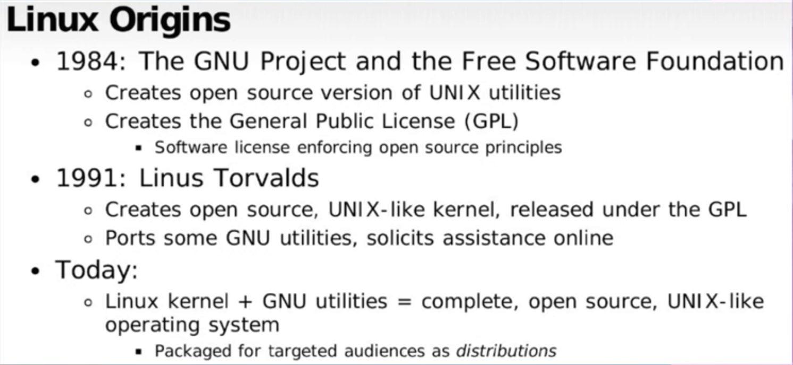

### **Introduction to Linux for DevOps**
- Linux is foundational for DevOps and this course
- The section is designed for efficiency - learning a lot in a short time
- Even experienced Linux admins may benefit from reviewing

### **Course Content Overview**
1. **Linux Basics**: Commands, file operations, directories
2. **File Systems & Text Editing**: Permissions, editing files
3. **Filters & Redirection**: Critical for DevOps work
4. **Users & Groups**: Including sudo usage
5. **Software Management**: RPM, Debian, Yum, Apt package systems
6. **Services & Processes**
7. **Server Management**: Setting up web/database servers

>Open Source Software (OSS) refers to software whose source code is publicly available for anyone to view, modify, and distribute.
>>Doesn't open source just mean something is free of charge? - Common Misconception



### **Why Linux?**
- Open source with strong community support
- Runs on diverse hardware (phones to supercomputers)
- Highly customizable
- Dominates server environments
- Easier to automate than Windows
- Generally more secure (though debatable)

### **Linux Architecture**
- Hardware → Kernel → Shell → Commands/Tools → User
- The kernel (created by Linus Torvalds) is the core component


>Kernel − It is the core component of Operating System, interacts directly with hardware, provides low level services to upper layer components.

>Shell − An interface to kernel, hiding complexity of kernel's functions from users. The shell takes commands from the user and executes kernel's functions.

### **Key Linux Principles**
1. **Everything is a file** (including hardware devices)
2. **Small, single-purpose programs** that can be combined
3. **Avoids captive user interfaces** (prefers non-interactive)
4. **Configuration via text files** (easy to automate/modify)

### **Popular Linux Distributions**
- **Desktop**: Ubuntu, Linux Mint, Fedora, Debian
- **Server**: 
  - **RPM-based**: RHEL(Red Hat Enterprise Linux), CentOS, Amazon Linux
  - **Debian-based**: Ubuntu Server

### **RPM vs. Debian**
| Feature       | RPM-based (RHEL/CentOS) | Debian-based (Ubuntu) |
|--------------|------------------------|-----------------------|
| Package Format | .rpm files           | .deb files            |
| Install Command | `rpm -ivh`          | `dpkg -i`             |
| Philosophy   | Stability-focused     | Latest software       |
| Use Case     | Production servers    | DevOps/experimentation|

### **Linux Directory Structure**
| Directory      | Purpose |
|---------------|---------|
| `/home`       | User home directories |
| `/root`       | Root user's home |
| `/bin`, `/usr/bin` | User commands |
| `/sbin`, `/usr/sbin` | Admin commands |
| `/etc`        | Configuration files |
| `/var`       | Server data (websites, databases) |
| `/tmp`       | Temporary files (may be cleared on reboot) |
| `/boot`      | Kernel and boot files |
| `/proc`, `/sys` | System information |

---
### **Basic Commands**

### 🖥️ **Vagrant VM Setup**

* **Check VM status:**

  ```bash
  vagrant global-status
  ```
* **Navigate to the CentOS VM folder:**

  ```bash
  cd /f/vagrant-vm/centos/
  ```
* **Start the VM:**

  ```bash
  vagrant up
  ```
* **SSH into the VM:**

  ```bash
  vagrant ssh
  ```

---

### 🔧 **Basic Linux Commands**

* **Clear screen:**

  ```bash
  clear
  ```

#### **User Info & Directory**

* **Current user:**

  ```bash
  whoami    # e.g., vagrant
  ```
* **Current working directory:**

  ```bash
  pwd       # e.g., /home/vagrant
  ```
* **List files in current directory:**

  ```bash
  ls
  ```
* **Read file (e.g., OS info):**

  ```bash
  cat /etc/os-release
  ```

---

### 👤 **User Prompt Explanation**

* `vagrant@localhost:~$`

  * `vagrant`: username
  * `localhost`: hostname
  * `~`: home directory
  * `$`: regular user prompt

---

### 🔐 **Switching to Root User**

* **Use `sudo` to switch to root:**

  ```bash
  sudo -i
  ```
* New prompt:

  * `root@localhost:~#`

    * `#` denotes root user shell
* **Verify:**

  ```bash
  whoami    # root
  pwd       # /root
  ```

---

### 📁 **Important Directories in Linux**

* **Root directory:**

  ```bash
  cd /
  pwd       # /
  ```

  This is the base of the Linux file system.

* **Root user's home directory:**

  ```
  /root
  ```

* **Regular user's home directories:**

  ```
  /home/username
  ```

* **View all top-level directories:**

  ```bash
  ls /
  ```

---

### 📂 **Special Directories and Files**

| Directory       | Purpose                                            |
| --------------- | -------------------------------------------------- |
| `/bin`          | User executables (e.g., `whoami`, `pwd`)           |
| `/sbin`         | System executables (e.g., `mkfs.ext4`, `reboot`)   |
| `/etc`          | Configuration files (e.g., `hostname`, `yum.conf`) |
| `/tmp`          | Temporary file storage (auto-cleaned)              |
| `/boot`         | Kernel and bootloader files (`vmlinuz`, `grub/`)   |
| `/proc`         | Virtual filesystem for system information          |
| `/var` & `/srv` | Variable and service data                          |

---

### ⚙️ **Examples of Commands**

* **Check hostname:**

  ```bash
  cat /etc/hostname
  ```
* **Check system uptime:**

  ```bash
  uptime
  ```
* **Check memory usage:**

  ```bash
  free -m
  ```

---

### 📌 Notes

* **`cd` with no arguments** returns to **user's home directory**.
* Files in `/proc` like `/proc/uptime` are **dynamically generated** and reflect live system data.
* **Absolute path** starts with `/` (e.g., `/bin`), whereas relative path does not.

---

### 🔐 User Sessions

* `sudo -i` to switch to root user.
* `exit` to log out of root and vagrant users.
* `vagrant ssh` to SSH back into the virtual machine.

---

### 📁 Directory Management

* `mkdir dev` creates a directory named `dev`.
* `mkdir ops backup` creates multiple directories at once.

---

### 📄 File Creation

* `touch testfile.txt` creates an empty file.
* `touch devopsfile{1..10}.txt` creates 10 files: `devopsfile1.txt` to `devopsfile10.txt`.

---

### 📋 Copying Files

* `cp devopsfile1.txt dev/` uses **relative path**.
* `cp /home/vagrant/devopsfile2.txt /home/vagrant/dev/` uses **absolute path** (recommended for beginners.. start from root).
* To copy directories:

  * `cp -r dev backup/`
  * Without `-r`, it fails (`omitting directory` error).

---

### 🧭 Path Basics

* `cd ~` or just `cd` takes you to home directory.
* Relative path: from your current location.
* Absolute path: from root `/`.

---

### ⚙️ Linux Command Syntax

Format: `command [options] [arguments]`
Examples:

* `ls -l /tmp`
* `cp -r source/ dest/` (copy folder don't work directly, we have to use -r)
* `cp --help` shows command help with options.

---

### 🔁 Moving Files and Directories

* `mv devopsfile3.txt ops/` moves a file.
* `mv ops/ dev/` moves a directory.
* `mv testfile1.txt testfile22.txt` renames a file.

---

### ✴️ Wildcards & Globs

* `*` means everything in the current directory.
* `mv *.txt textdir/` moves all `.txt` files to `textdir`.

---

### 🗑️ Deleting Files & Directories

* `rm filename.txt` deletes a file.
* `rm -r dirname/` deletes a directory.
* `rm -rf *` deletes **everything** in the current directory:

  > ⚠️ Very dangerous! No recycle bin or undo.
  > Can irreversibly delete important system files.

---

### 🧾 Final Tips

* Use `history` to view all previously run commands.
* Practice with caution, especially when using `rm`.

---

## **Vim Editor Basics (Transcript Summary)**

### **1. Introduction to Vim**

* `vim` is a text editor used in Linux.
* It's an enhanced version of `vi`.
* If `vim` isn't installed on CentOS, install it using:

  ```bash
  sudo yum install vim -y
  ```

### **2. Starting Vim**

* To create or open a file:

  ```bash
  vim filename.txt
  ```

### **3. Vim Modes**

* **Command Mode** (default): For navigation and commands.
* **Insert Mode**: Press `i` to enter. You can type text here.
* **Extended Mode**: Press `:` to enter. Used for commands like saving or quitting.

### **4. Saving and Quitting**

* Press `ESC` to return to command mode.
* `:w` → Save file.
* `:q` → Quit.
* `:wq` → Save and quit.
* `:q!` → Force quit without saving.

### **5. Editing Text**

* Open the file with `vim filename.txt`
* Press `i` or `o` to insert text.
* Type content. 
* Press `ESC`, then `:wq` to save and exit.

### **6. Navigation Shortcuts**

* `:set nu` → Show line numbers.
* `gg` → Go to the first line.
* `G` (Shift + g) → Go to the last line.
* `5w` → Move 5 words forward.
* `5b` → Move 5 words back.

### **7. Copy, Cut, Paste**

* `yy` → Copy (yank) current line.
* `4yy` → Copy 4 lines.
* `p` → Paste below.
* `P` → Paste above.
* `dd` → Delete (cut) current line.
* `5dd` → Delete 5 lines.
* `u` → Undo last action.

### **8. Search in Vim**

* `/word` → Search for `word`.
* `n` → Jump to next match.
* `N` → Jump to previous match.
* Searches are **case sensitive**.

### **9. Practice Tip**

* Practice using Vim commands to get comfortable.
* Try opening, editing, saving, and quitting files often.
* Use `vim` on larger files to practice navigation and editing shortcuts.
>os installing info \: `vim anaconda-ks.cfg`
---

### 🔹 **Everything is a File in Linux**

* In Linux, **everything is treated as a file**: text files, directories, devices like keyboard/mouse, terminals (`tty`), etc.

---

### 🔹 **Types of Files (based on `ls -l`)**

* Prefix in permissions string indicates file type:

  | Symbol | Type              | Description                                            |
  | ------ | ----------------- | ------------------------------------------------------ |
  | `-`    | Regular file      | Can be text or binary (e.g. `.txt`, compiled binaries) |
  | `d`    | Directory         | Folder                                                 |
  | `c`    | Character device  | For serial data (e.g., keyboard, mouse)                |
  | `b`    | Block device      | For block data (e.g., hard disks)                      |
  | `l`    | Symbolic link     | Like a shortcut to another file                        |
  | `s`    | Socket            | Used for inter-process communication                   |
  | `p`    | Named pipe (FIFO) | For communication between processes                    |

---

### 🔹 **Commands Demonstrated**

#### `ls -l`

* Long listing: shows type, permissions, owner, size, timestamp, etc.

#### `file <filename>`

* Tells if a file is **ASCII text**, **binary**, **script**, etc.

#### `mkdir -p <path>`

* Creates **nested directories** if they don’t already exist.

#### `ln -s <target> <link_name>`

* Creates a **symbolic (soft) link**.
* If the original file is moved/deleted, the link becomes a **dead link**.

#### `rm <link>` or `unlink <link>`

* Deletes the link (not the original file).

#### `ls -lt`

* Sorts files by **timestamp (latest first)**.

#### `ls -ltr`

* Sorts by **timestamp in reverse** (latest last).

#### `hostname`

* Displays the current hostname.

#### Editing hostname:

```bash
sudo vim /etc/hostname
```

* Change hostname and save.
* It reflects after logout and login.

---

### 🔹 **Additional Tips**

* **Link status**: If the original file is missing, soft links will show as **broken** (highlighted or blinking).
* Use **absolute paths** when possible to avoid path issues.
* **File types in `/dev`**: Device files such as `tty`, `sda`, `rtc0` show various types (`c`, `b`, etc.).
* **Text editors** like `vim` are used to modify config files (e.g., changing hostname).

---

### 🔹 **File History**

* `history`: Show command history.
* `sudo -i`: Switch to root and get root user history.

---

## 🛠️ **Linux Filters and Redirections**

### 🎯 **Core Concepts Covered**

1. **Filtering data from files**
2. **Redirection of input/output**
3. **Useful commands** for system administration and scripting

---

### 🔍 **Filtering Tools**

| Command        | Purpose                                  |
| -------------- | ---------------------------------------- |
| `grep`         | Search text patterns in files            |
| `cut`          | Extract columns based on delimiters      |
| `awk`          | Advanced pattern scanning and processing |
| `less`, `more` | Paginated file reading                   |
| `head`, `tail` | Display first/last lines of files        |

---

### 📂 **Redirection Types**

| Redirection | Symbol | Description                                 |                                                |
| ----------- | ------ | ------------------------------------------- | ---------------------------------------------- |
| Input       | `<`    | Pass file as input to a command             |                                                |
| Output      | `>`    | Redirect command output to file (overwrite) |                                                |
| Append      | `>>`   | Append command output to file               |                                                |
| Error       | `2>`   | Redirect error stream                       |                                                |
| Pipe        | \`     | \`                                          | Send output of one command as input to another |

---

### 🔎 **`grep` Usage**

```bash
grep firewall anaconda-ks.cfg           # Case-sensitive search 
grep firewall < anaconda-ks.cfg   # by default input redirections

grep -i firewall *                      # Case-insensitive across all files
grep -iR firewall .                    # Recursive search (get also directory)
grep -R SELINUX /etc/*                 # with subdirectory 

grep -v firewall anaconda-ks.cfg       # Show lines NOT matching
```
---

### **`less` Command**
- **Basic Usage**:  
  `less /etc/passwd`  
  Displays the content of `/etc/passwd` interactively.

- **Navigation**:  
  - **Enter**: Scroll down line by line.  
  - **d**: Jump to the next page.  
  - **b**: Return to the previous page.  
  - **/**: Search for a specific word (e.g., `/root` finds "root").  
  - **v**: Switch to `vi` mode to edit the file. Saving changes in `vi` returns you to `less`.

### **Purpose**
`less` is ideal for viewing large files without loading them entirely into memory, offering efficient navigation and search capabilities. It improves upon `more` by allowing backward movement and additional features.  

### **Example Workflow**
1. Open a file: `less /var/log/syslog`  
2. Press **d** to page forward, **b** to go back.  
3. Search for "error": `/error` (press **n** for next match).  
4. Edit: Press **v**, modify the file in `vi`, save (`:wq`), and continue viewing.  

This makes `less` a versatile tool for both viewing and quick edits.

---

###  `more` Command  
**Purpose**: Views file content page-wise or line-by-line (similar to `less`, but with fewer features).  

#### **Usage**:  
```bash
more /etc/passwd
```

#### **Key Controls**:  
- **Enter**: Scroll down line by line.  
- **d**: Jump to the next page.  
- **/**: Search for a word (e.g., `/root`).  
- **v**: Switch to `vi` mode to edit the file. Saving changes returns to `more`.  

#### **Note**:  
- Unlike `less`, `more` does **not** support scrolling backward (use `less` for bidirectional navigation).  

---

### `head` Command 
**Purpose**: Displays the **top 10 lines** of a file by default (useful for quick previews).  

#### **Usage**:  
```bash
head /etc/passwd
```

#### **Example Output**:  
```plaintext
root:x:0:0:root:/root:/bin/bash
bin:x:1:1:bin:/bin:/sbin/nologin
daemon:x:2:2:daemon:/sbin:/sbin/nologin
adm:x:3:4:adm:/var/adm:/sbin/nologin
lp:x:4:7:lp:/var/spool/lpd:/sbin/nologin
sync:x:5:0:sync:/sbin:/bin/sync
shutdown:x:6:0:shutdown:/sbin:/sbin/shutdown
halt:x:7:0:halt:/sbin:/sbin/halt
mail:x:8:12:mail:/var/spool/mail:/sbin/nologin
uucp:x:10:14:uucp:/var/spool/uucp:/sbin/nologin
```

#### **Custom Line Count**:  
To show **N lines** (e.g., 5):  
```bash
head -n 5 /etc/passwd
head -5 /etc/passwd
```

---

The screenshot explains the **`tail`** command in Linux, which is used to display the **end of a file**. Below is a clear breakdown of its functionality, usage, and examples:

---

### **`tail` Command**  
**Purpose**: Displays the **last 10 lines** of a file by default (useful for monitoring logs or recent changes).  

#### **Basic Syntax**:  
```bash
tail /etc/passwd
```

#### **Example Output**:  
```plaintext
apache:x:48:48:Apache:/var/www:/sbin/nologin
nsLcd:x:65:55:LDAP Client User:/:/sbin/nologin
avahi:x:70:70:Avahi mDNS/DNS-SD Stack:/var/run/avahi-daemon:/sbin/nologin
ntp:x:38:38:/etc/ntp:/sbin/nologin
pulse:x:496:494:PulseAudio System Daemon:/var/run/pulse:/sbin/nologin
gdm:x:42:42:/var/lib/gdm:/sbin/nologin
sshd:x:74:74:Privilege-separated SSH:/var/empty/sshd:/sbin/nologin
tcpdump:x:72:72:/:/sbin/nologin
visitor:x:500:500:visitor:/home/visitor:/bin/bash
ktuser:x:501:501:/home/ktuser:/bin/bash
```

---

### **Key Features & Options**  
1. **Custom Line Count**:  
   Show the last `N` lines (e.g., 5):  
   ```bash
   tail -n 5 /etc/passwd
   ```

2. **Monitor Real-Time Updates (Logs)**:  
   Continuously display new lines appended to a file (e.g., log files):  
   ```bash
   tail -f /var/log/syslog
   ```
   - **Ctrl+C** to exit.  

3. **Show Bytes Instead of Lines**:  
   Display the last `N` bytes (e.g., 100 bytes):  
   ```bash
   tail -c 100 /etc/passwd
   ```

---

### **Practical Use Cases**  
1. **Check Recent Log Entries**:  
   ```bash
   tail -n 20 /var/log/nginx/error.log
   ```

2. **Track Live Logs**:  
   ```bash
   tail -f /var/log/auth.log
   ```

3. **Verify File Updates**:  
   After editing a file, confirm the last few lines:  
   ```bash
   tail -n 3 ~/my_script.sh
   ```

---

### **Summary**  
- **Default**: `tail` shows the last 10 lines.  
- **Essential Flags**:  
  - `-n <number>`: Customize line count.  
  - `-f`: Follow real-time updates (critical for logs).  
- **Complementary to `head`**: Use both to inspect file **start** vs. **end**.  

---

### 📄 **`cut` and `awk` Examples**

```bash
cut -d ':' -f1 /etc/passwd              # Get first column (usernames)
awk -F':' '{print $1}' /etc/passwd      # Same with awk, more flexible
```

* -d (delemeter / separator)
* -f1 (field 1/ first column)

```bash
[root@localhost ~]# less /etc/passwd

root:x:0:0:root:/root:/bin/bash
bin:x:1:1:bin:/bin:/sbin/nologin
daemon:x:2:2:daemon:/sbin:/sbin/nologin
adm:x:3:4:adm:/var/adm:/sbin/nologin
lp:x:4:7:lp:/var/spool/lpd:/sbin/nologin
sync:x:5:0:sync:/sbin:/bin/sync

[root@localhost ~]# cut -d ':' -f1 /etc/passwd
root
bin
daemon
adm
lp
sync
```
- for any advanced or inteligence search awk is better
---

### 🔁 **Search and Replace**

#### 📝 Using `vim`

```vim
:%s/coronavirus/covid-19/g              # Replace all occurrences globally
:%s/covid-19//g                         # Replace with nothing
```
- without /g (globally) it changes which occur first
#### 🔧 Using `sed` (for multiple file)

```bash
sed 's/coronavirus/covid-19/g' file.txt             # Preview change
sed -i 's/coronavirus/covid-19/g' file.txt           # Save changes
```

---

### 📜 **Reading Log Files**

```bash
tail -f /var/log/messages               # Live view of logs
less /var/log/messages                  # Scrollable view
```

---

### 🧪 **Example: Monitoring SSH Login**

* Use `tail -f /var/log/messages` in one shell.
* Login via `ssh` from another terminal.
* Observe dynamic log update.

---

### 🛡️ **Admin Tips**

* Use filters (`grep`, `cut`, `awk`) to search config files like `/etc/passwd`, `/etc/selinux/...`
* Use `tail -f` to live monitor logs for debugging (important for trobleshooting)
* Automate changes in multiple files using `sed -i`
* Combine filters with pipes for powerful scripting

---

## 🧭 **1. Input/Output Redirection in Linux**

### 🔹 Standard Output (stdout)

* Default output goes to the screen (monitor).
* Redirect stdout to a file:

  ```bash
  command > file.txt
  ```

  * Creates the file if it doesn't exist.
  * Overwrites the file if it exists.

### 🔹 Append Output

* Use `>>` to append instead of overwrite:

  ```bash
  command >> file.txt
  ```

### 🔹 Redirect Output Example

```bash
uptime > /tmp/sysinfo.txt
ls >> /tmp/sysinfo.txt
```

---

## 🗑️ **2. Discard Output with `/dev/null`**

* Sends output to a black hole (discard):

  ```bash
  command > /dev/null
  ```

### 🔹 Clear a File Using `/dev/null`

```bash
cat /dev/null > file.txt
```

---

## 🛠️ **3. Standard Error (stderr) Redirection**

### 🔹 Send errors to a file:

```bash
command 2> error.log
```

### 🔹 Send both stdout and stderr:

```bash
command &> output.log
```

* `1>` = stdout
* `2>` = stderr
* `&>` = both

---

## 📄 **4. Sample Commands for Practice**

### ✅ Common system info commands:

```bash
uptime             # system uptime
free -m            # RAM and swap usage
df -h              # Disk usage
echo "Text"        # Print text
date               # Current date/time
```

---

## 🧪 **5. Piping (|)**

* Send the output of one command as input to another.

```bash
command1 | command2
```

### Examples:

```bash
ls /etc | wc -l              # Count files in /etc
ls -l | tail                 # Show last 10 lines of ls -l
free -m | grep Mem           # Filter only memory line
tail -20 /var/log/messages | grep vagrant
```

---

## 🔍 **6. Searching with `grep`**

```bash
ls /etc | grep host
```

* Searches for lines containing “host”.

---

## 🔎 **7. Finding Files**

### 🔹 Real-time search:

```bash
find /etc -name "host*"
```

* Can be slow at root (`/`) level.

### 🔹 Database-based search (faster):

```bash
sudo apt install mlocate      # Install if needed
sudo updatedb                 # Update the locate DB
locate host                   # Fast file search
```

* ⚠️ Must run `updatedb` to get latest info.

---

## 📜 **8. Logs and Redirection in Scripting**

* Long-running or background scripts often redirect output to log files:

```bash
./script.sh > /var/log/myscript.log 2>&1
```

---

## 📂 **9. History of Commands**

```bash
history
```

---

## ✅ Summary Table 


### **Linux Redirection Symbols Cheat Sheet**
<table>
  <tr>
    <th>Symbol</th>
    <th>Purpose</th>
    <th>Example</th>
    <th>Explanation</th>
  </tr>
  <tr>
    <td><code>></code></td>
    <td>Redirect stdout (overwrite)</td>
    <td><code>ls > out.txt</code></td>
    <td>Saves output of <code>ls</code> to <code>out.txt</code>, overwriting existing content.</td>
  </tr>
  <tr>
    <td><code>>></code></td>
    <td>Redirect stdout (append)</td>
    <td><code>date >> out.txt</code></td>
    <td>Appends the current date to <code>out.txt</code> without deleting previous content.</td>
  </tr>
  <tr>
    <td><code>2></code></td>
    <td>Redirect stderr</td>
    <td><code>ls abc 2> error.txt</code></td>
    <td>Captures the error message (if <code>abc</code> doesn’t exist) into <code>error.txt</code>.</td>
  </tr>
  <tr>
    <td><code>&></code></td>
    <td>Redirect both stdout and stderr</td>
    <td><code>ls abc &> all.txt</code></td>
    <td>Saves both output and errors to <code>all.txt</code>.</td>
  </tr>
  <tr>
    <td><code>|</code></td>
    <td>Pipe output to another command</td>
    <td><code>ls -l | grep ".txt"</code></td>
    <td>Lists files and filters lines containing <code>.txt</code>.</td>
  </tr>
  <tr>
    <td><code>/dev/null</code></td>
    <td>Discard output</td>
    <td><code>ls > /dev/null</code></td>
    <td>Silences stdout (useful for suppressing output).</td>
  </tr>
  <tr>
    <td><code>cat /dev/null > file</code></td>
    <td>Clear a file</td>
    <td><code>cat /dev/null > log.txt</code></td>
    <td>Empties <code>log.txt</code> without deleting the file.</td>
  </tr>
  <tr>
    <td><code><</code></td>
    <td>Redirect stdin</td>
    <td><code>sort < names.txt</code></td>
    <td>Uses <code>names.txt</code> as input for the <code>sort</code> command.</td>
  </tr>
  <tr>
    <td><code>2>&1</code></td>
    <td>Redirect stderr to stdout</td>
    <td><code>ls abc > out.txt 2>&1</code></td>
    <td>Saves both stdout and stderr to <code>out.txt</code> (older syntax).</td>
  </tr>
</table>

---

### **Key Notes:**
1. **Order Matters**:  
   - `2>&1 > file` ≠ `> file 2>&1`. The latter redirects both streams to the file.  
2. **Common Use Cases**:  
   - **Logs**: Append (`>>`) to log files without overwriting.  
   - **Debugging**: Separate stdout and stderr (e.g., `2> errors.log`).  
   - **Pipes**: Chain commands (e.g., `ps aux | grep nginx`).  

### **Example Workflow:**
```bash
# Redirect all output (stdout + stderr) to a log file, then email it:
ls /nonexistent &> debug.log && mail -s "Log" user@example.com < debug.log
```

---

### **Linux Users & Groups: Core Concepts**
#### **1. Purpose of Users/Groups**
- Control access to files, resources, and processes.  
- Every file is owned by a **user** and an associated **group** (e.g., `/etc/passwd`, `/etc/group`).  
- Permissions are assigned via `chmod` (symbolic/numeric) and `chown`/`chgrp`.

#### **2. User Types**
| Type          | UID/GID Range      | Home Dir       | Login Shell          | Example               |
|---------------|--------------------|----------------|----------------------|-----------------------|
| **Root**      | `0`                | `/root`        | `/bin/bash`          | `root`                |
| **Regular**   | `≥1000`            | `/home/user`   | `/bin/bash`          | `vagrant`, `ansible`  |
| **System**    | `1–999`            | `/var`/`/etc`  | `/sbin/nologin`      | `apache`, `sshd`      |

#### **3. Key Files**
- **`/etc/passwd`**:  
  Format: `username:x:UID:GID:comment:homedir:shell`  
  Example: `root:x:0:0:root:/root:/bin/bash`  
  - `x` indicates password is in `/etc/shadow`.  

- **`/etc/shadow`**: Stores encrypted passwords and expiry details.  
- **`/etc/group`**:  
  Format: `groupname:x:GID:members`  
  Example: `devops:x:1001:ansible,jenkins`  

---

### **Commands & Operations**
#### **1. User Management**
- **Create User**:  
  ```bash
  useradd ansible  # Creates user with default home dir
  passwd ansible   # Set password
  ```
- **Delete User**:  
  ```bash
  userdel ansible          # Keeps home dir
  userdel -r jenkins       # Deletes home dir too
  ```

#### **2. Group Management**
- **Create Group**:  
  ```bash
  groupadd devops
  ```
- **Add User to Group**:  
  ```bash
  usermod -aG devops ansible  # Adds to supplementary group
  ```
  Or edit `/etc/group` directly:  
  ```plaintext
  devops:x:1001:ansible,jenkins
  ```
- **Delete Group**:  
  ```bash
  groupdel devops
  ```

#### **3. Switching Users**
- **Root to Any User**: No password needed.  
  ```bash
  su - ansible
  ```
- **Regular Users**: Password required.  
  ```bash
  su - jenkins
  ```

#### **4. Monitoring Users**
- **Current User**:  
  ```bash
  whoami      # Shows username
  who         # Lists logged-in users
  last        # Shows login history
  ```
- **Open Files by User**:  
  ```bash
  lsof -u ansible  # Installed via `yum install lsof`
  ```

---

### **Practical Examples**
#### **1. Create a Service User**
```bash
useradd -s /sbin/nologin -M apache_user  # No shell, no home dir
```

#### **2. Bulk Add Users to Group**
```bash
usermod -aG devops jenkins aws ansible
```

#### **3. Verify User/Group Info**
```bash
id ansible          # Shows UID, GID, groups
grep devops /etc/group  # Lists group members
```

---

### **Key Takeaways**
- **Root User**: Unlimited access (UID 0).  
- **System Users**: For background processes (e.g., `sshd`).  
- **Primary vs. Supplementary Groups**:  
  - Primary: Default group (same as username).  
  - Supplementary: Additional permissions (e.g., `devops`).  
- **Security**: Use `/sbin/nologin` for service users to prevent shell access.

---

### **Next Steps**
- **File Permissions**: Use `chmod` (e.g., `chmod 755 file`) and `chown` (e.g., `chown user:group file`).  
- **Sudo Privileges**: Grant admin rights via `/etc/sudoers` (edit with `visudo`).  

---


# 📁 Linux File Permissions & Ownership

## 🧾 File Ownership
Every file/directory in Linux has:
- A **user (owner)**
- A **group**
- **Others** (everyone else)

Use `ls -l` to view file ownership and permissions.

---

## 🔤 Symbolic File Permissions

Format example:
```
-rwxr-xr-- 1 user group 4096 date file.txt
```

Breakdown:
- `-` = file type (`-`, `d`, `l`, etc.)
- `rwx` = user permissions
- `r-x` = group permissions
- `r--` = others permissions

| Symbol | Meaning        |
|--------|----------------|
| `r`    | Read           |
| `w`    | Write          |
| `x`    | Execute        |
| `-`    | No permission  |

---

## 🔧 chmod: Changing Permissions

### Symbolic Method
```bash
chmod u+x file       # Add execute for user
chmod g-w file       # Remove write for group
chmod o=r file       # Set read-only for others
```

### Numeric Method
```bash
chmod 640 file
```

- `6` (user): 4+2 → read + write
- `4` (group): read only
- `0` (others): no access

| Value | Meaning             |
|-------|---------------------|
| 7     | rwx (read, write, execute) |
| 6     | rw- (read, write)   |
| 5     | r-x (read, execute) |
| 4     | r-- (read only)     |
| 0     | --- (no permission) |

---

## 👤 chown: Changing Ownership
```bash
chown user:group file
```

- `-R`: change recursively

Example:
```bash
chown ansible:devops /opt/devopsdir
```

---

## 📁 Directory Permissions

| Permission | Effect                       |
|------------|------------------------------|
| `r`        | List contents (`ls`)         |
| `w`        | Add/remove files             |
| `x`        | Access directory via `cd`    |

---

## 👥 Users and Groups (From Demo)

- **Users**: ansible, jenkins, aws, miles
- **Group**: devops
- **Added to group**: ansible, jenkins, aws
- **Not added**: miles

---

## 🔐 Access Control (Observed Behavior)

| User   | Access to `/opt/devopsdir` | Permissions         |
|--------|-----------------------------|---------------------|
| miles  | ❌ Denied                   | Not in group        |
| aws    | ✅ Allowed                  | Member of devops    |

---

## 🧪 chmod Examples

```bash
chmod 640 file.txt    # User: rw-, Group: r--, Others: ---
chmod 770 dir/        # User & Group: rwx, Others: ---
chmod 755 script.sh   # User: rwx, Group/Others: r-x
```

---

## ⚠️ Tips

- Use `ls -ld` to inspect directory permissions.
- Be cautious with `chmod -R` or `chown -R`.
- Symbolic = readable, Numeric = fast for scripting.

---

# 🔐 Using `sudo` and `sudoers` in Linux 

## ✅ What is `sudo`?

* `sudo` allows permitted users to **execute commands as another user**, typically root.
* Acts like a **power of attorney** – grants elevated privilege temporarily.
* Common usage:

  ```bash
  sudo -i            # switch to root user
  sudo yum install git  # install packages with root privileges
  ```

---

## 🔍 Why Can't All Users Use `sudo`?

* Only users listed in the **sudoers** configuration are allowed.
* Unauthorized users get:

  ```
  <user> is not in the sudoers file. This incident will be reported.
  ```

---

## 🔧 Granting `sudo` Access

### Step 1: Set a Password for the User (if needed)

```bash
passwd <username>
```

### Step 2: Use `visudo` to Edit Safely

```bash
sudo visudo
```

> 🔒 **Do NOT use `vim /etc/sudoers` directly** – syntax errors can lock you out of `sudo`.

### Step 3: Add Entry for User

Add below the `root` user entry:

```
ansible ALL=(ALL) ALL
```

To allow without password:

```
ansible ALL=(ALL) NOPASSWD:ALL
```

---

## ✅ Verifying Access

From the target user:

```bash
sudo -i                  # should switch to root
sudo useradd test_user   # test root-level command
```

---

## 💥 Sudoers Syntax Error?

* If you make a mistake in `sudoers`, you’ll see:

  ```
  >>> /etc/sudoers: syntax error near line X <<<
  ```
* Use `visudo` again and press `e` to edit and fix.
* Saving with syntax errors can **break sudo** and lock out all users.

---

## 🛡️ Best Practice: Use `/etc/sudoers.d/`

Instead of editing `/etc/sudoers`, do this:

```bash
sudo vim /etc/sudoers.d/devops
```

Add:

```
%devops ALL=(ALL) NOPASSWD:ALL
```

* `%devops` = devops group (use `%` for groups).
* Safer because one broken file won’t corrupt the main config.
* You can create user-specific entries here too.

---

## 👥 Example Scenario from Video

* **Users**: `vagrant`, `ansible`
* **Groups**: `devops`
* **Steps**:

  * `ansible` initially lacked sudo rights.
  * Added via `visudo`
  * Enabled passwordless sudo with `NOPASSWD`
  * Used `/etc/sudoers.d/devops` for safer access control

---

## ⚠️ Summary of Best Practices

| Tip                            | Reason                                |
| ------------------------------ | ------------------------------------- |
| Always use `visudo`            | Prevent syntax errors                 |
| Prefer `/etc/sudoers.d/`       | Modular, safer configuration          |
| Use `NOPASSWD` cautiously      | Avoid password prompts for automation |
| Never `chmod` or `vim` sudoers | It can break `sudo` entirely          |

---

# 🐧 Linux Quickstart Guide

## 📂 File Ownership & Permissions

In Linux, **every file/directory** has:

* An **owner (user)** and a **group**
* Permissions for:

  * **User** (owner)
  * **Group**
  * **Others**

### Permission Types

| Symbol | Meaning         | Numeric |
| ------ | --------------- | ------- |
| `r`    | Read            | 4       |
| `w`    | Write           | 2       |
| `x`    | Execute (or CD) | 1       |
| `-`    | No permission   | 0       |

### Example: `-rwxr-xr--`

* User: read, write, execute → `7`
* Group: read, execute → `5`
* Others: read only → `4`

**Changing Permissions:**

```bash
chmod 750 file.txt        # numeric
chmod o-r file.txt        # symbolic (remove read for others)
chmod g+w file.txt        # add write for group
```

**Changing Ownership:**

```bash
chown ansible:devops file.txt
chown -R ansible:devops /opt/devopsdir
```

## 🧑‍💻 Sudo & Sudoers

**Sudo** allows non-root users to execute commands as root.

### Granting Sudo Access

1. Run:

```bash
visudo
```

2. Add:

```bash
ansible  ALL=(ALL)  NOPASSWD:ALL
```

Alternatively, create a file in `/etc/sudoers.d/`:

```bash
echo "%devops ALL=(ALL) NOPASSWD:ALL" > /etc/sudoers.d/devops
```

This avoids breaking the main `/etc/sudoers` file.

## 📦 Software Management

### 🔧 RPM (Manual)

Install a `.rpm` file:

```bash
rpm -ivh package.rpm
```

List installed packages:

```bash
rpm -qa
rpm -qa | grep tree
```

Uninstall:

```bash
rpm -e tree
```

### ✅ YUM (With Dependencies)

Search:

```bash
yum search httpd
```

Install:

```bash
yum install httpd -y
```

Remove:

```bash
yum remove httpd -y
```

Update all packages:

```bash
yum update -y
```

Install from external repository:

```bash
# Add repo
sudo wget -O /etc/yum.repos.d/jenkins.repo https://pkg.jenkins.io/redhat/jenkins.repo
sudo rpm --import https://pkg.jenkins.io/redhat/jenkins.io-2023.key

# Install
yum install jenkins java-11-openjdk -y
```

### Other Yum Commands

| Command                         | Description               |
| ------------------------------- | ------------------------- |
| `yum repolist`                  | Show enabled repos        |
| `yum clean all`                 | Clear repo cache          |
| `yum info package`              | Show details of a package |
| `yum group list`                | List group packages       |
| `yum group install "Dev Tools"` | Install group packages    |
| `yum history`                   | View yum command history  |

---

## ⚙️ Linux Services Management (`systemctl`)

In Linux, many background programs are managed as **services** using `systemctl`.

### 🔍 Checking Service Status

```bash
systemctl status httpd          # Detailed status
systemctl is-active httpd       # Active/inactive only
systemctl is-enabled httpd      # Enabled/disabled on boot
```

### 🚀 Starting, Stopping, Enabling Services

| Action      | Command                   |
| ----------- | ------------------------- |
| Start       | `systemctl start httpd`   |
| Stop        | `systemctl stop httpd`    |
| Restart     | `systemctl restart httpd` |
| Reload conf | `systemctl reload httpd`  |
| Enable      | `systemctl enable httpd`  |
| Disable     | `systemctl disable httpd` |

> Services like `httpd` (Apache web server) need `enable` to auto-start on boot.

### 🔄 Boot Persistence

After `yum install httpd`, to persist the service across reboots:

```bash
systemctl enable httpd
systemctl start httpd
```

### 🔗 Service Configuration File Path

When a package is installed via `yum`, its systemd service file (unit file) is usually placed at:

```bash
/etc/systemd/system/multi-user.target.wants/httpd.service
```

This file contains instructions like:

```ini
ExecStart=/usr/sbin/httpd -DFOREGROUND
ExecStop=/bin/kill -WINCH ${MAINPID}
```

These define how to start and stop the service.

---


## 🧠 Linux Process Management (Monitoring & Control)

Processes are fundamental to Linux operation. You can manage, monitor, and kill them using built-in commands.

### 🔍 View Running Processes

| Command  | Description                                         |
| -------- | --------------------------------------------------- |
| `top`    | Real-time CPU, memory, and process activity         |
| `ps aux` | Snapshot of all processes with CPU and memory usage |
| `ps -ef` | All processes with parent-child relationships       |

#### `top` Key Metrics

* **Load Average**: CPU wait time (1, 5, and 15 mins).
* **PID**: Process ID.
* **USER**: Who runs the process.
* **%CPU / %MEM**: Resource usage.
* **S**: Process state (e.g., `S` = sleeping, `R` = running).

### 🧼 Cleaning Up Processes

#### 🔪 Gracefully Kill a Process

```bash
kill <PID>
```

#### 🧨 Forcefully Kill a Process

```bash
kill -9 <PID>
```

#### 💡 Filter and Kill by Name

```bash
ps -ef | grep httpd | grep -v grep | awk '{print $2}' | xargs kill -9
```

### 🌳 Process Relationships

| Term        | Description                                                   |
| ----------- | ------------------------------------------------------------- |
| **PID**     | Process ID                                                    |
| **PPID**    | Parent Process ID                                             |
| **Forking** | One process (parent) spawns other processes (children)        |
| **Orphan**  | Parent process killed; child now adopted by PID 1 (`systemd`) |
| **Zombie**  | Dead process still in process table (state = `Z`)             |

> 🧟 Zombie processes don't use resources but clutter process tables. Best fix: `reboot`.

---

# Linux Archiving and Compression

---

## 1. Introduction to Archiving

* Archiving is the process of collecting multiple files or directories into a single file.
* Common use cases:

  * Taking backups
  * Restoring backups
  * Handling archive files downloaded from the internet or elsewhere
* Archiving can be combined with compression to save disk space.

---

## 2. Archiving with `tar` Command

### What is `tar`?

* `tar` stands for **tape archive**.
* It is a legacy (old but still widely used) archiving tool in Linux.
* `tar` can create archives and compress them using different algorithms.

### Basic syntax for creating a compressed tar archive (tarball):

```bash
tar -czvf archive_name.tar.gz /path/to/directory_or_files
```

### Explanation of options:

* `c`: Create a new archive
* `z`: Compress the archive using gzip (gunzip)
* `v`: Verbose output (show the progress)
* `f`: Specify the filename of the archive

### Example:

* Archiving the `jenkins` directory inside `/var/log`:

```bash
cd /var/log
tar -czvf jenkins_<timestamp>.tar.gz jenkins
```

* The output file will be a **tarball**: `jenkins_<timestamp>.tar.gz`

---

## 3. Checking the Archive File Type

* Use `ls -ltr` to list files sorted by modification time.
* Use the `file` command to check the file type, e.g.:

```bash
file jenkins_<timestamp>.tar.gz
```

* It should report: **gzip compressed data** or similar.

---

## 4. Extracting (Unarchiving) Tarballs

### Basic extraction command:

```bash
tar -xzvf archive_name.tar.gz
```

* `x`: Extract files from archive
* `z`: Decompress gzip
* `v`: Verbose output
* `f`: Specify archive filename

### Extracting to a specific directory:

```bash
tar -xzvf archive_name.tar.gz -C /desired/path
```

* `-C` specifies the directory where to extract.

---

## 5. Additional `tar` Features and Options

* Compare tarballs using `-d` option.
* Update an existing tarball.
* Other compression methods:

  * `-a` : Auto detect compression
  * `-j` : Use bzip2 compression
  * `-J` : Use xz compression
* `tar` is a **feature-rich** and versatile tool for archiving in Linux.

---

## 6. Archiving with `zip` Command

* Simpler alternative to `tar`.
* May need to install first on some systems:

```bash
yum install zip unzip
```

### Creating a zip archive (recursive):

```bash
zip -r archive_name.zip directory_to_compress
```

* `-r`: Recursively compress directory contents.

### Example:

```bash
zip -r httpd_<timestamp>.zip httpd
```

---

## 7. Extracting Zip Archives

* Use `unzip` command:

```bash
unzip archive_name.zip
```

* To extract in current directory or overwrite files.

---

## 8. Example Workflow Summary

* Archive Jenkins logs using `tar`:

```bash
cd /var/log
tar -czvf jenkins_06122020.tar.gz jenkins
```

* Move archive to another directory, e.g., `/tmp` or `/opt`:

```bash
mv jenkins_06122020.tar.gz /tmp
cd /tmp
tar -xzvf jenkins_06122020.tar.gz
```

* Extract to a different directory:

```bash
tar -xzvf jenkins_06122020.tar.gz -C /opt
```

* Using `zip`:

```bash
zip -r jenkins_06122020.zip jenkins
mv jenkins_06122020.zip /opt
cd /opt
unzip jenkins_06122020.zip
```

---

## 9. General Notes

* `tar` and `zip` are the two most common methods for archiving/compressing files in Linux.
* `tar` is more feature-rich and flexible, especially for complex archiving.
* `zip` is simpler and widely supported, especially in Windows environments.
* Knowing both commands is useful depending on the task.

---

# Ubuntu Operating System Basics & Differences Compared to CentOS

### 1. Introduction & Environment Setup

* Ubuntu commands are mostly similar to CentOS except for a few differences.
* The session uses a Vagrant VM for Ubuntu (`/f/vagrant-vms/ubuntu`).
* VM can be managed using `vagrant global-status` and `vagrant up`.
* Connect to VM via `vagrant ssh`.
* Check OS version with `/etc/os-release` (Ubuntu 22).

---

### 2. User Management Differences

* `useradd` command in Ubuntu **does not** create a home directory by default.
* `useradd devops` creates user but no home directory or mail spool.
* To delete user including home directory: `userdel -r devops` (may warn if no home directory exists).
* **Preferred Ubuntu command**: `adduser` (not `useradd`).

  * `adduser devops` creates:

    * User and group `devops`
    * Home directory with default files copied from `/etc/skel`
    * Sets user password and optional info (full name, room number, phone, etc.)
* `/etc/skel` contains template files copied into new user’s home directory.
* Ubuntu tools for user management:

  * `passwd` to set/change password
  * `groupadd` to add groups
  * `usermod` to modify users

---

### 3. Default Editor & visudo

* `visudo` opens the sudoers file.
* On Ubuntu, default editor for `visudo` is **nano** (instead of `vi` or `vim`).
* To switch default editor to vim temporarily:

  * Run: `export EDITOR=vim`
  * This setting lasts only for the current shell session.
* After setting, `visudo` opens in vim; use `:q` to quit.
* To make permanent, add export command to shell profile (covered later in Bash scripting).

---

### 4. Package Management Differences

* Ubuntu uses `apt` (or `apt-get`) instead of `yum` (used in CentOS).
* Ubuntu package info stored in `/etc/apt/sources.list`.
* `apt update`:

  * Updates package lists from repositories.
  * Must be run before installing or upgrading packages.
* `apt search <package>`:

  * Searches for packages matching `<package>`.
* `apt install <package>`:

  * Installs package with dependencies.
* `apt upgrade`:

  * Upgrades all installed packages to latest versions.
* `apt remove <package>`:

  * Removes package but keeps config files.
* `apt purge <package>`:

  * Removes package **and** its config files (clean uninstall).
* Packages can also be manually downloaded as `.deb` files and installed using:

  * `dpkg -i <package>.deb`
  * `dpkg -r <package>` to remove

---

### 5. Service Management

* Installing services like Apache2 automatically starts and enables the service.
* Check status with systemctl (`systemctl status apache2`).
* Firewall in Ubuntu uses **UFW** (Uncomplicated Firewall).
* Package installs may update firewall rules automatically.

---

### 6. Summary of Key Differences Ubuntu vs CentOS

| Aspect          | CentOS                     | Ubuntu                                                                                 |
| --------------- | -------------------------- | -------------------------------------------------------------------------------------- |
| User Creation   | `useradd` creates home dir | `useradd` does NOT create home dir by default, prefer `adduser` which creates home dir |
| Default Editor  | vi/vim                     | nano (default for `visudo`)                                                            |
| Package Manager | yum                        | apt / apt-get                                                                          |
| Service Start   | manual start after install | auto-start after install                                                               |
| Firewall        | firewalld                  | UFW                                                                                    |

---

### 7. Tips & Notes

* Use `adduser` in Ubuntu for interactive user creation with home dir.
* Use `export EDITOR=vim` before `visudo` for vim editor.
* Run `apt update` regularly before installing/upgrading packages.
* `apt purge` for clean package removal including config files.
* Practice these commands to get comfortable with Ubuntu.

---