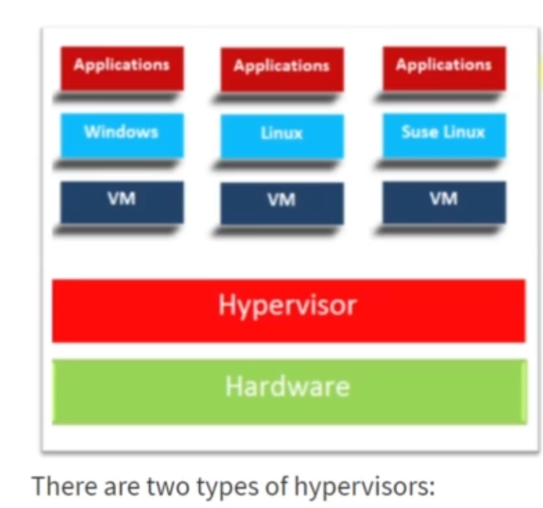
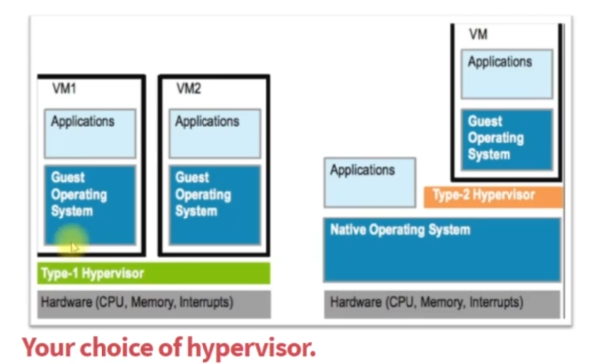

# 🖥️ Virtualization: A Beginner-Friendly Guide

This document introduces **virtualization**, its importance, components, types, and how to set up a **Linux Virtual Machine (VM) lab** using both manual and automated methods.

---

## 📘 What is Virtualization?

> **Virtualization** allows one physical computer to act like multiple independent computers by creating **virtual machines (VMs)**.

* Run **multiple operating systems** (OS) in parallel on a single computer.
* Partition **physical resources** (CPU, RAM, Disk) into **virtual resources**.
* Create isolated **virtual environments** (VMs) on a single machine.

---

## 🕰️ Before Virtualization

* Each service (e.g., Tomcat, MySQL, Apache HTTPD) required a **dedicated physical server**.
* The practice was: **"One service per server"** for isolation.
* Led to:

  * **Over-provisioning** and **underutilization** of hardware
  * **High costs**: More servers = more capital, power, cooling, and maintenance
  * **Scalability issues**: Needed one physical machine per service, and double for high availability

---

## 🚀 After Virtualization (VMware's Approach)

* VMware introduced tools to run **multiple OS instances** on a single machine.

* Each service runs on an isolated **guest OS** within a VM.

* Improves:

  * Resource utilization
  * Cost-efficiency
  * Flexibility and scalability

* **Hypervisors** can be **clustered** for high availability — if one host fails, others take over running VMs.

---

## 🧩 Key Concepts and Terminologies

| Term                     | Description                                                                          |
| ------------------------ | ------------------------------------------------------------------------------------ |
| **Virtual Machine (VM)** | A virtual computer running inside a physical machine. Also called a *guest machine*. |
| **Host OS**              | The operating system installed on the physical computer (e.g., Windows 10, macOS).   |
| **Guest OS**             | The OS inside a VM (e.g., Ubuntu, CentOS).                                           |
| **Snapshot**             | A point-in-time backup of a VM — useful for testing and rollback.                    |
| **Hypervisor**           | Software that enables VM creation and management. Two types: Type 1 and Type 2.      |



---

## 🧱 Types of Hypervisors

### 🛠️ Type 1: Bare Metal Hypervisor

* Runs **directly on hardware** (no host OS)
* Used in **production environments**
* Examples: **VMware ESXi**, **Xen Hypervisor**, **Microsoft Hyper-V**

### 💻 Type 2: Hosted Hypervisor

* Runs **on top of an existing OS**
* Ideal for **testing, learning, and development**
* Examples: **Oracle VM VirtualBox**, **VMware Workstation**



---

## 🧪 Virtual Machine Lab: Linux Practice

You'll create two Linux VMs for hands-on experience:

* ✅ **CentOS** (Red Hat-based)
* ✅ **Ubuntu** (Debian-based)

---

## 🛠️ Setup Methods

### 1. Manual Setup

* Use VirtualBox's GUI to:

  * Create VM
  * Mount ISO
  * Install OS
  * Configure settings

### 2. Automated Setup

* Write a `Vagrantfile`
* Run `vagrant up` to auto-create and configure VMs

> ⚠️ **Note:** Learn the manual method first — automation is a logical assembly of those manual steps.

---

## 💻 System Requirements

| Requirement  | Description                               |
| ------------ | ----------------------------------------- |
| **CPU**      | 64-bit system                             |
| **Internet** | High-speed connection                     |
| **Host OS**  | Windows 10/11, macOS (Intel/M1), or Linux |

---

## 🧰 Tools Overview

| Tool                     | Purpose                                                                     |
| ------------------------ | --------------------------------------------------------------------------- |
| **Oracle VM VirtualBox** | Required hypervisor for manual and automated setup (except for macOS M1/M2) |
| **CentOS / Ubuntu ISO**  | Linux OS installation files                                                 |
| **Git Bash / PuTTY**     | SSH and terminal access to VMs                                              |
| **Vagrant**              | Automates VM creation and provisioning                                      |

> 🧭 Later in the course, you'll migrate from local VMs to **AWS Cloud**, simulating real-world infrastructure.

---

## 🧪 Course Lab Structure

| Lab                     | Description                                                                  |
| ----------------------- | ---------------------------------------------------------------------------- |
| **Manual Setup Lab**    | Create VMs using VirtualBox and ISO files to learn Linux installation basics |
| **Automated Setup Lab** | Use Vagrant and a config file to quickly provision preconfigured VMs         |

---

## 🎯 Lab Goals

* Learn and practice **Linux administration**
* Build foundations for **DevOps** tools like Docker and Kubernetes
* Understand **virtual environments** before transitioning to the cloud

---

## 📌 Summary

**Virtualization** is the stepping stone to **DevOps**, **cloud computing**, and **infrastructure automation**. Mastering it prepares you for modern, scalable, and efficient IT environments.

---

# Virtual Machine Setup Guide (Manual)

This guide walks through creating Linux virtual machines (CentOS and Ubuntu) using Oracle VM VirtualBox, including BIOS settings, network configuration, and OS installation.

## Table of Contents
1. [Prerequisites](#1-prerequisites)
2. [BIOS Configuration](#2-bios-configuration)
3. [Windows Feature Adjustments](#3-windows-feature-adjustments)
4. [Creating Virtual Machines](#4-creating-virtual-machines)
5. [OS Installation](#5-os-installation)
6. [Network Configuration](#6-network-configuration)
7. [SSH Access](#7-ssh-access)

---

## 1. Prerequisites
- Windows OS (Mac users skip BIOS steps)
- Oracle VM VirtualBox installed
- Minimum 4GB RAM (8GB recommended)
- 20GB free disk space per VM

## 2. BIOS Configuration
1. Reboot computer and enter BIOS (typically F2, F12, DEL, or ESC)
2. Enable virtualization settings:
   - Intel VT-x or AMD-V
   - Secure Virtual Machine (if available)
   - Virtualization
3. Save changes and reboot

## 3. Windows Feature Adjustments
1. Search for "Turn Windows features on or off"
2. Disable:
   - Microsoft Hyper-V
   - Windows Hypervisor Platform
   - Windows Subsystem for Linux
   - Virtual Machine Platform
   - Docker Platform
3. Reboot after changes

>if ip address not found in vm then do this order of step -> Power off PC + Reboot Router + Power on PC 

## 4. Creating Virtual Machines

### CentOS VM
1. Open VirtualBox → New
   - Name: `CentOS VM`
   - Type: Linux
   - Version: Red Hat (64-bit)
2. Memory: 2048MB (1GB if limited RAM)
3. Create virtual disk (20GB, dynamically allocated)
4. CPU: 1 core

### Ubuntu VM
1. Open VirtualBox → New
   - Name: `Ubuntu VM`
   - Type: Linux
   - Version: Ubuntu (64-bit)
2. Memory: 2048MB
3. Create virtual disk (20GB)
4. CPU: 2 cores

## 5. OS Installation

### AlmaLinux/CentOS Installation
1. Download ISO: [AlmaLinux 9.2 x86_64 boot ISO](https://mirrors.almalinux.org/)
2. Attach ISO to VM storage
3. Start VM → Select "Install CentOS Stream 9"
4. Installation settings:
   - Language: English
   - Installation Destination: Automatic partitioning
   - Network: Verify bridged adapter shows IP
   - Root Password: Set secure password
   - User Creation: Create standard user
5. Complete installation → Power off → Remove ISO

### Ubuntu Installation
1. Download ISO: [Ubuntu 22.04 LTS Server](https://ubuntu.com/download/server)
2. Attach ISO to VM storage
3. Start VM → Follow installer prompts:
   - Language: English
   - Network: Verify bridged adapter
   - Filesystem: Use entire disk
   - Profile: Set username/password
   - SSH: Enable OpenSSH server
4. Complete installation → Power off → Remove ISO

## 6. Network Configuration
For each VM:
1. Go to Settings → Network
2. Enable Adapter 2:
   - Attached to: Bridged Adapter
   - Name: Select your active network interface (WiFi/Ethernet)
3. Verify IP assignment:
   ```bash
   ip addr show
   ```
   - Note bridged adapter IP (e.g., 192.168.1.10)

## 7. SSH Access
1. From host machine (Git Bash):
   ```bash
   ssh username@vm_ip
   ```
   Example:
   ```bash
   ssh devops@192.168.1.11
   ```
2. Enter password when prompted

## Troubleshooting
- **No 64-bit option**: Re-enable virtualization in BIOS
- **No IP address**: 
  1. Power cycle computer and router
  2. Verify bridged adapter settings
  3. Check firewall settings
- **Installation fails**: 
  1. Verify ISO checksum
  2. Increase VM resources (RAM/CPU)

## Next Steps
- Take VM snapshots before making changes
- Explore automated provisioning with Vagrant

---
# Vagrant Virtual Machine Management Guide (Automated)

This guide provides instructions for automating virtual machine management using Vagrant, including setup, configuration, and basic commands.

## Table of Contents
1. [Introduction](#1-introduction)
2. [Prerequisites](#2-prerequisites)
3. [Setup Process](#3-setup-process)
4. [Basic Vagrant Commands](#4-basic-vagrant-commands)
5. [Troubleshooting](#5-troubleshooting)
6. [Next Steps](#6-next-steps)

---

## 1. Introduction
Vagrant is a VM automation tool that:
- Manages VM lifecycle (create, modify, destroy)
- Uses pre-built VM images (boxes) from Vagrant Cloud
- Configures VMs through simple text files (Vagrantfile)
- Works with hypervisors like VirtualBox, VMware, etc.

## 2. Prerequisites
- Oracle VM VirtualBox installed
- Vagrant installed
- Git Bash (Windows) or Terminal (Mac)
- Disabled antivirus (if experiencing issues)
- Disabled VPN connections

## 3. Setup Process

### Create Project Structure
```bash
# Create main directory
mkdir /f/vagrant-vms  # Windows
mkdir ~/Desktop/vagrant-vms  # Mac

# Navigate to directory and create subfolders
cd /f/vagrant-vms
mkdir centos ubuntu
```

### CentOS VM Setup
1. Find box on [Vagrant Cloud](https://app.vagrantup.com/boxes/search):
   - Search for "centos-stream-9"
   - Select "eurolinux-vagrant/centos-stream-9"

2. Initialize VM:
```bash
cd centos
vagrant init eurolinux-vagrant/centos-stream-9
```

3. Start VM:
```bash
vagrant up
```

### Ubuntu VM Setup
1. Find box on Vagrant Cloud:
   - Search for "ubuntu jammy"
   - Select "ubuntu/jammy64"

2. Initialize VM:
```bash
cd ../ubuntu
vagrant init ubuntu/jammy64
```

3. Start VM:
```bash
vagrant up
```

## 4. Basic Vagrant Commands

### VM Lifecycle
```bash
# Start VM
vagrant up

# SSH into VM
vagrant ssh

# Power off VM
vagrant halt

# Reboot VM
vagrant reload

# Delete VM
vagrant destroy
```

### Information Commands
```bash
# List downloaded boxes
vagrant box list

# Check VM status (current folder)
vagrant status

# Check all VMs status
vagrant global-status

# Clean up old entries
vagrant global-status --prune
```

### Inside VM
```bash
# Switch to root user
sudo -i

# Exit root/user session
exit

# Check network configuration
ip addr show
```

## 5. Troubleshooting

### Common Issues
1. **Schannel/VBox Hardening Errors**:
   - Disable antivirus temporarily
   - Disconnect VPN if connected

2. **No 64-bit Option**:
   - Enable virtualization in BIOS:
     - Intel VT-x or AMD-V
     - Secure Virtual Machine

3. **Corporate Network Issues**:
   - Try different internet connection
   - Check proxy settings

4. **VM Not Getting IP**:
   - Power cycle computer and router
   - Verify bridged adapter settings

## 6. Next Steps
- Keep these VMs for Linux section practice
- Experiment with different boxes
- Explore provisioning in Vagrantfiles
- Learn to customize VM resources (RAM, CPU)
- Practice command line navigation:
  - `cd`, `ls`, `pwd`, `history`
