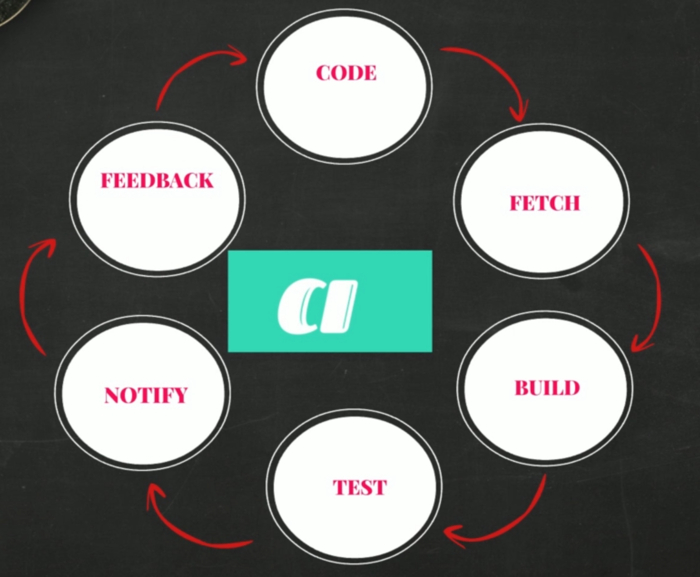
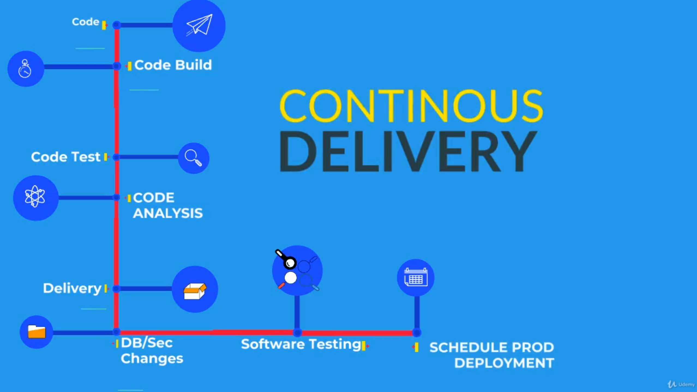

# ⚙️ Continuous Integration (CI) in DevOps

**Continuous Integration (CI)** is a core DevOps practice that automates the process of building, testing, and validating code whenever a team member commits changes to version control.

---

## 🎬 Introduction to CI

> **"Continuous integration is an automated process in DevOps, which generates software and its features quickly and efficiently."**

In a modern development environment, developers collaborate by writing code in teams. It’s ideal to store and manage this code in a **centralized version control system** like GitHub.

---

## 🔁 The CI Workflow

### 👩‍💻 Developers' Workflow:

- Write several lines of code daily.
- Frequently push/pull changes to/from a central repository.

### 🧠 Behind the Scenes:

1. **Version Control System (e.g., GitHub)** stores the code.
2. **Build Server** fetches the code continuously.
3. Code is **built, tested, and evaluated**.
4. An **artifact** (the packaged software) is generated and stored.

---

## 📦 What is an Artifact?

An artifact is an **archive of files** generated by the build process.

Examples:

- **Java**: `.jar`, `.war`
- **Windows**: `.exe`, `.dll`, `.msi`
- **General**: `.zip`, `.tar.gz`

Once built, these artifacts are stored in **software repositories** and moved to test or production servers.

---

## 🐛 Problems Without CI

Without continuous integration:

- Developers commit large amounts of code over weeks.
- Build fails due to **bugs, conflicts, and outdated dependencies**.
- Delayed bug detection leads to **rework and frustration**.

> “This could have been much easier if problems were caught earlier.”

---

## ✅ CI: The Solution

> “After every commit, the code should be built and tested—automatically.”

### 🔄 CI Cycle:

1. Developer commits code.
2. CI tool fetches it.
3. It’s automatically:

   - **Built**
   - **Tested**
   - **Evaluated**

4. Notification sent for success or failure.
5. Fix → Re-commit → Repeat.

This way, **defects are detected early** and do not multiply.

---

## 🔃 Visualize the CI Cycle

```text
[Code Commit] → [Build] → [Test] → [Notify] → [Fix] → [Repeat]
```



This forms a continuous **feedback loop**, ensuring each piece of code is clean and deployable.

---

## 🧰 CI Ecosystem Tools

| **Component**       | **Examples**                                                          |
| ------------------- | --------------------------------------------------------------------- |
| **IDE**             | Eclipse, VS Code, Atom, PyCharm                                       |
| **Version Control** | Git, SVN, TFS, Perforce                                               |
| **Build Tools**     | Maven, Ant, Gradle, MSBuild, Visual Build, IBM UrbanCode, Make, Grunt |
| **Software Repos**  | Sonatype Nexus, JFrog Artifactory, Apache Archiva, Cloudsmith         |
| **CI Tools**        | Jenkins, CircleCI, TeamCity, Bamboo CI, CruiseControl                 |

---

## 🎯 Goal of CI

- **Detect defects early**.
- **Avoid long integration cycles**.
- **Speed up delivery** of tested, production-ready software.

---

# 🚚 Continuous Delivery (CD) in DevOps

**Continuous Delivery (CD)** is an automated software engineering process that ensures code changes are reliably and efficiently delivered to production-like environments.

---

## 📌 What is Continuous Delivery?

> **"Continuous Delivery is an automated process of delivering code changes to servers quickly and efficiently at an enormous pace."**

It is the **natural extension of Continuous Integration (CI)**.

---

## 🔄 CI → CD Flow

1. Developers push code.
2. CI automatically builds and tests the code.
3. If successful, an **artifact** is created and stored in a **software repository**.
4. CD takes this artifact and **automates the deployment** process to staging, QA, or production servers.

---

## 🧱 Problems Without CD

- Ops teams manually deploy builds for further testing.
- Manual deployment is error-prone and slow.
- Frequent **deployment failures** increase lead time.
- Agile practices generate constant code changes needing deployment.
- **Too much manual intervention** and back-and-forth communication between Dev, Ops, and QA.

---

## 🛠️ What Deployment Really Involves

Deployment is **not just copying files** to a server. It can also include:

- Provisioning infrastructure (e.g., VMs, containers).
- Installing server dependencies.
- Modifying configurations.
- Adjusting firewall and network rules.
- Executing deployment steps and post-deployment validations.

---

## 🤖 Automate Everything!

> **"Automate it and save your time—and failures."**

### 🔧 Tools for Automation:

| **Category**           | **Tools**                 |
| ---------------------- | ------------------------- |
| System Automation      | Ansible, Puppet, Chef     |
| Infrastructure as Code | Terraform, CloudFormation |
| CI/CD Automation       | Jenkins, Octopus Deploy   |

---

## 🧪 Automate Testing Too!

Testing types that should be automated:

- Functional
- Load/Performance
- Database
- Network
- Security
- And more…

### Collaboration:

- **Ops Team**: Writes deployment automation.
- **Testers**: Write test automation scripts.
- **Developers**: Integrate everything into source control.

---

## 🔁 Unified Pipeline = Continuous Delivery

A fully automated pipeline looks like this:

```text
Code Commit →
Build & Test (CI) →
Artifact Creation →
Infrastructure Provisioning →
Deployment →
Automated Testing →
Ready for Production
```

## 

## 🧩 Everything Stitched Together

> **"Automate every step and then stitch everything together."**

When deployment and testing are fully automated and integrated, we achieve:

### ✅ **Continuous Delivery Automation**

---
